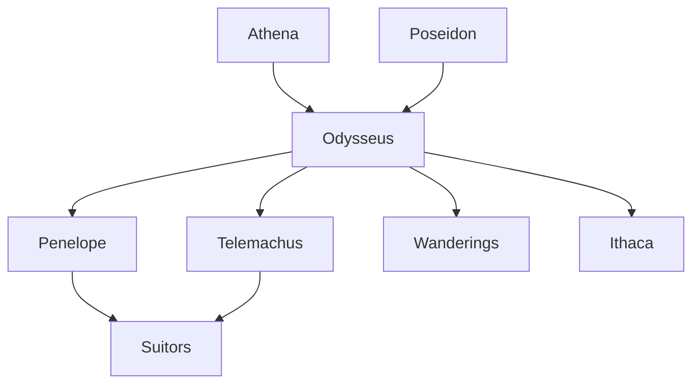

> [!TIP]
> Characters are grouped by dramatic function, not moral rank. Many move between roles as guest, host, stranger, kin, captive, or disguised observer.

## House of Odysseus

[Odysseus](./odysseus.md) · [Penelope](./penelope.md) · [Telemachus](./telemachus.md) · [Laertes](./laertes.md) · [Anticlea](./anticlea.md) · [Eurycleia](./eurycleia.md) · [Argos](./argos.md)

## Divine powers

[Athena](./athena.md) · [Poseidon](./poseidon.md) · [Zeus](./zeus.md) · [Hermes](./hermes.md) · [Helios](./helios.md) · [Ino](./ino.md)

## Hosts and guides

[Calypso](./calypso.md) · [Circe](./circe.md) · [Nausicaa](./nausicaa.md) · [Alcinous](./alcinous.md) · [Arete](./arete.md) · [Eumaeus](./eumaeus.md) · [Philoetius](./philoetius.md) · [Nestor](./nestor.md) · [Menelaus](./menelaus.md) · [Helen](./helen.md) · [Pisistratus](./pisistratus.md) · [Proteus](./proteus.md) · [Eidothea](./eidothea.md) · [Mentor](./mentor.md)

## Monsters and marvels

[Polyphemus](./polyphemus.md) · [Scylla](./scylla.md) · [Charybdis](./charybdis.md) · [Sirens](./sirens.md) · [Lotus Eaters](./lotus-eaters.md) · [Laestrygonians](./laestrygonians.md) · [Aeolus](./aeolus.md)

## Ithaca and the suitors

[Antinous](./antinous.md) · [Eurymachus](./eurymachus.md) · [Amphinomus](./amphinomus.md) · [Medon](./medon.md) · [Phemius](./phemius.md) · [Melanthius](./melanthius.md) · [Melantho](./melantho.md) · [Theoclymenus](./theoclymenus.md) · [Irus](./irus.md) · [Leodes](./leodes.md) · [Ctesippus](./ctesippus.md) · [Eupithes](./eupithes.md) · [Dolius](./dolius.md) · [Halitherses](./halitherses.md)

## Memory of Troy and Hades

[Tiresias](./tiresias.md) · [Elpenor](./elpenor.md) · [Eurylochus](./eurylochus.md) · [Agamemnon](./agamemnon.md) · [Achilles](./achilles.md) · [Ajax](./ajax.md) · [Heracles](./heracles.md) · [Orestes](./orestes.md) · [Clytemnestra](./clytemnestra.md) · [Aegisthus](./aegisthus.md) · [Demodocus](./demodocus.md) · [Iphitus](./iphitus.md)

## A note on completeness

This hub foregrounds the principal cast and major collectives. The [named figures register](./named-figures-register.md) adds secondary gods, suitors, Phaeacians, companions, kin, and figures embedded in songs, memories, and the underworld catalogue. The [minor-figures guide](./reading-minor-figures.md) explains how to interpret brief appearances without turning them into trivia or overgrown stubs.[^butler]

[^butler]: [Samuel Butler translation](../external-sources/project-gutenberg-odyssey.md)
