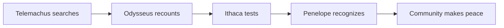

> [!NOTE]
>
> *The Odyssey* is a poem of return in which reaching home is only the beginning. It asks how identity survives absence, how stories create or conceal truth, and whether a household recovered through violence can become a community again.[^butler]

## Enter the poem

| Voyage | People | Ideas | World | Afterlives | Scholarship |
| --- | --- | --- | --- | --- | --- |
| [All 24 books](story/overview.md) | [Character constellation](characters/constellation.md) | [Themes and motifs](themes/overview.md) | [Context and poetics](world/overview.md) | [Translations and adaptations](reception/overview.md) | [Texts and verification](scholarship/overview.md) |

## Four ways in

**First reading** — start with the [story map](story/overview.md), then open each book in order.

**Character study** — begin with [Odysseus](characters/odysseus.md), [Penelope](characters/penelope.md), and [Telemachus](characters/telemachus.md), then widen out through the [constellation](characters/constellation.md).

**Close reading** — trace [recognition](themes/recognition.md), [hospitality](themes/xenia.md), [cunning](themes/metis.md), [storytelling](themes/storytelling.md), or [violence and justice](themes/violence-and-justice.md) across the whole poem.

**After Homer** — compare [translations](reception/translations.md), then follow literature, cinema, television, visual art, comics, and speculative fiction through the [reception hub](reception/overview.md).

## The shape at a glance

- **Books 1–4:** a son's search creates the conditions for a father's return.
- **Books 5–8:** a nameless survivor becomes a guest and storyteller.
- **Books 9–12:** the wanderer narrates the adventures that destroyed his fleet.
- **Books 13–24:** disguise, tests, recognition, violence, reunion, and peace remake Ithaca.[^britannica]

> [!TIP]
> Is the poem's deepest achievement the hero's return—or its discovery that no return can simply reverse time?

[About this example](README.md) · [Scholarship and verification](scholarship/overview.md) · [Sources](external-sources/index.md) · [License](LICENSE.md) · [Third-party notices](THIRD-PARTY-NOTICES.md) · [Build log](log.md)

[^butler]: [Samuel Butler translation](external-sources/project-gutenberg-odyssey.md)

[^britannica]: [Britannica overview](external-sources/britannica-odyssey.md)
