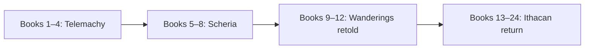

> [!TIP]
> Read straight through with the numbered links, or use the four movements to jump into the poem's architecture.

## The twenty-four books

[1](./book-01.md) · [2](./book-02.md) · [3](./book-03.md) · [4](./book-04.md) · [5](./book-05.md) · [6](./book-06.md) · [7](./book-07.md) · [8](./book-08.md) · [9](./book-09.md) · [10](./book-10.md) · [11](./book-11.md) · [12](./book-12.md) · [13](./book-13.md) · [14](./book-14.md) · [15](./book-15.md) · [16](./book-16.md) · [17](./book-17.md) · [18](./book-18.md) · [19](./book-19.md) · [20](./book-20.md) · [21](./book-21.md) · [22](./book-22.md) · [23](./book-23.md) · [24](./book-24.md)

## The four movements

### Books 1–4 · Son

[Book 1](./book-01.md) · [Book 2](./book-02.md) · [Book 3](./book-03.md) · [Book 4](./book-04.md)

Ithaca's disorder is viewed through [Telemachus](../characters/telemachus.md); stories of other returns supply models and warnings.

### Books 5–8 · Stranger

[Book 5](./book-05.md) · [Book 6](./book-06.md) · [Book 7](./book-07.md) · [Book 8](./book-08.md)

[Odysseus](../characters/odysseus.md) moves from isolated captive to anonymous guest and finally named storyteller.

### Books 9–12 · Wanderer

[Book 9](./book-09.md) · [Book 10](./book-10.md) · [Book 11](./book-11.md) · [Book 12](./book-12.md)

The hero narrates the marvelous voyage himself, placing his leadership and reliability under scrutiny.

### Books 13–24 · Returner

[Book 13](./book-13.md) through [Book 24](./book-24.md)

Arrival unfolds through disguise, testing, recognition, violence, reunion, and peace.

## Two clocks

The narrated wanderings occur earlier than the Phaeacian present in which they are told. Chronology and disclosure diverge: readers meet consequences before hearing causes.[^butler]

[^butler]: [Samuel Butler translation](../external-sources/project-gutenberg-odyssey.md)
